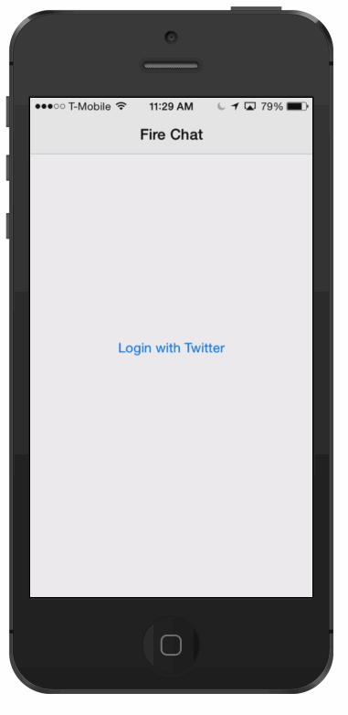
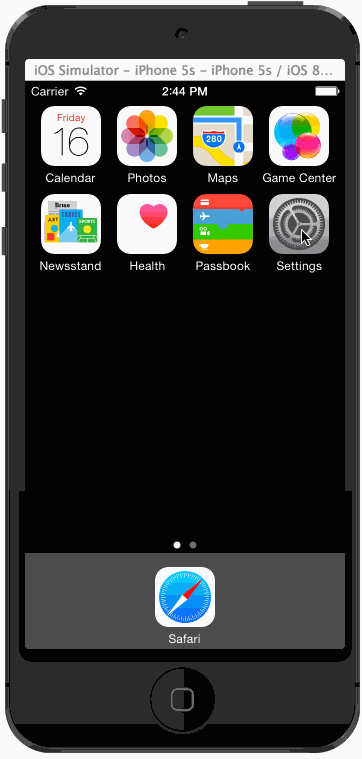

Swift Chat Example
==============

Chat implemented in Swift! Now works in Xcode 6.0.1.

## What's here

* You can log in with Twitter.
* You can post / receive messages
* Powered by [Firebase](https://www.firebase.com/)

If you have issues with XCTest, check out [this issue](https://github.com/firebase/ios-swift-chat-example/issues/5).

## Setup
This example still has some rough edges around authentication. Push through them, though. It's worth the effort.'

### Configure Firebase

0. Go to your [Firebase Dashboard](https://www.firebase.com/account/) and create a new Firebase app.
0. Clone this repo.
0. Open `FireChat-Swift.xcodeproj` in Xcode.
0. Edit [`MessagesViewController.swift`](FireChat-Swift/MessagesViewController.swift) and change `swift-chat.firebaseio.com` to point to your Firebase.

### Configure Login

0. Create a [new Twitter app](https://apps.twitter.com/) to use for login.
0. Go to your [Firebase Dashboard](https://www.firebase.com/account/) and navigate to your Firebase app.
0. Click 'Login & Auth' in the left side menu. Select 'Twitter' and check the box to 'Enable Twitter Login'
0. Paste your Twitter API Key and API Secret into the form.
0. Edit [`LoginViewController.swift`](FireChat-Swift/LoginViewController.swift) and change `swift-chat.firebaseio.com` to point to your Firebase. Update `twitterAppId` on the next line to match your Twitter API Key.
0. Run the app on a device or simulator
0. On your iOS device or simulator, go to Settings, scroll down to the accounts section (which contains Twitter, Facebook, Flickr and Vimeo), select Twitter -> Add Account.

## License
[MIT](http://firebase.mit-license.org)
